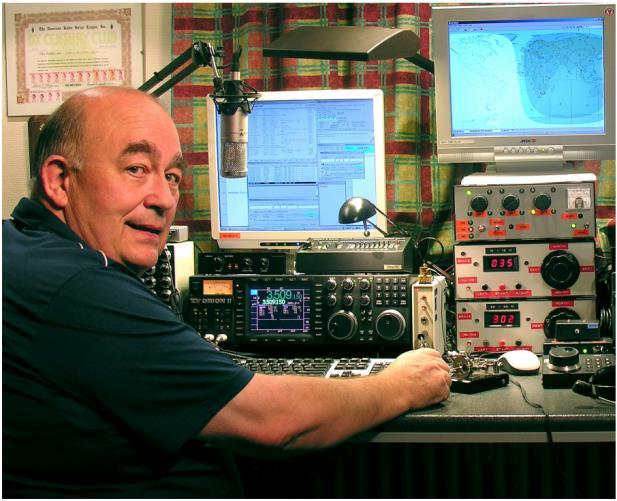

# Autoriai

John **ON4UN** su radijo mėgėjišku pasauliu susipažino būdamas dar 10-ies metų, savo dėdės Gaston **ON4GV** dėka. Vėliau vedamas susidomėjimo technologijomis ir mokslu, John tapo ryšių inžinieriumi ir savo profesinę veiklą vystė telekomunikacijų srityje, laisvalaikiu būdamas aktyviu radijo mėgėju, savo ryšių žurnale užregistavusiu daugiau nei pusę milijono ryšių.

1962 metais John laimėjo UBA CW varžybas, nors šios varžybos jam buvo pirmosios ir savo radijo mėgėjo šaukinį jis teturėjo vos metus. Šis laimėjimas pažymėjo ilgos, daugiau nei 50 metų trunkančios radijo mėgėjiškos kelionės pradžią, kurios metu buvo visko, nuo paprastų varžybų iki DX medžioklių žemuosiuose TB diapazonuose. Reikia paminėti, jog John 80-ies metrų diapazone yra pasaulio DXCC lyderis, turintis pirmosios vietos apdovanojimą ir 355 patvirtintus kontaktus, o 160 m ruože turi didžiausią DXCC ryšių bagažą, atmetat JAV operatorius, daugiau negu 300 šalių. John stotis yra pirmoji pasaulyje, gavusi prestižinį 5B-WAZ apdovanojimą.

1996 metais ON4UN, kartu su savo draugu Harry ON9CIB, atstovavo Belgiją San Francisco WRTC (_World Radio Team Championship_) varžybose. WRTC varžybos kitaip vadinamos radijo mėgėjų olimpinėmis žaidynėmis.

Ryškiausi John radijo mėgėjiškos karjeros momentai neabejotinai buvo jo įtraukimas į _CQ Contest Hall of Fame_ 1997 metais ir į _CQ DX Hall of Fame_ 2008 metais, nors šie garbingi apdovanojimai dažniausiai buvo suteikiami tik JAV radijo mėgėjams. John yra parašęs daug techninių knygų apie mėgėjišką radiją, nemaža dalis jų buvo išleista su ARRL (_American Radio Relay League_) pagalba. Šiose knygose aprašytos pačios geriausios antenų konstravimo praktikos, radijo bangų sklidimo ir darbo eteryje, ypač žemuosiuose TB diapazonuose, principai. Jis yra sukūręs nemažai programinės įrangos, skirtos antenų ir stiebų mechaniniam modeliavimui. Kartu su Rik ON7YD, jis išleido UBA vadovėlį, skirtą ruoštis HAREC licencijai. Jau 1963 metais, būdamas dar labai jaunas radijo mėgėjas, jis pradėjo dirbti nacionalinėje radijo mėgėjų organizacijoje ir trumpai buvo UBA trumpųjų bangų koordinatoriumi. Vėliau, nuo 1998 iki 2007 m., John buvo išrinktas UBA prezidentu.

John savo patirtimi ir žiniomis pasidalino su savo draugu bei kolega Mark ON4WW, šio dalinimosi rezultatas - unikalus vadovėlis - _Radijo mėgėjo etikos ir darbo eteryje kodeksas_. Šios knygos ištakos yra neįtikėtina anksčiau išleisto straipsnio, _Operating Practice_, įtraukto į UBA HAREC vadovėlį, sėkmė. Šis straipsnis išverstas į daugiau negu 15 kalbų; jį galima rasti Marko asmeniniame interneto puslapyje ir daugelyje pasaulio radijo mėgėjų leidinių.

Mark **ON4WW** taip pat buvo vos 10 metų, kai jį pirmą kartą pakirto radijo mėgėjiško uodo įkandimas. Jo pirmasis šaukinys 1988 metais buvo ON4AMT, kurį po kelių metų pakeitė ON4WW. Nuo pat pirmųjų dienų Mark buvo labai susidomėjęs radijo varžybomis, tai greičiausiai ir atkreipė Mark dėmesį į korektiško darbo radijo eteryje būtinybę ir galimybę. 1991 metais sutikęs ON4UN, po keleto apsilankymų pas John svečiuose jis greitai įvaldė tiek CW, tiek darbo žemuose trumpųjų bangų diapazonuose, 80 ir 160 metrų, meną. Paskutiniame dešimtmetyje Mark buvo vienas iš svarbiausių operatorių OTxT varžybų stotyje, kuri priklausė vietiniam UBA radijo klubui - TLS. Ne paslaptis, jog ši varžybų stotis įrengta ON4UN namuose ir minėtame laikotarpyje tris kartus iškovojo pirmą vietą pasaulyje savo (_multi-single_) kategorijoje bei pirmas vietas kitose CQ WW varžybose Europoje.

1995 metais Mark prisijungė prie Jungtinių Tautų ir kaip atstovas dalyvavo misijoje Ruandoje. Vėliau jis buvo siunčiamas į keletą kitų Afrikos šalių ir kiekvieną kartą buvo aktyvus eteryje, ypač 160 m ir 80 m (9X4WW, S07WW, EL2WW ir t.t.). Vėliau jo šaukinys pasigirdo Pakistane (AP2ARS), Afganistane (YA5T), o taip pat ir Irake (YI/ON4WW). Markas šiuo periodu naudojo ir daugiau kitų šaukinių, tokių kaip JY8WW, J28WW ir 9k/ON4WW. Marko paskutinė JT misija 2003 m. buvo Gambijoje (C5WW).

2000 metais Mark įgyvendino vieną iš savo svajonių - išvykti į didelę DX ekspediciją. Jis dalyvavo rekordinėje išvykoje FO0AAA į Klipertono salą, Ramiajame vandenyne, kur jo komanda vos per 6 dienas užmezgė daugiau negu 75 000 ryšių. Tais pačiais metais jis dalyvavo A52A ekspedicijoje Butane ir kartu su Peter ON6TT suspėjo atstovauti Belgiją Slovėnijos WRTC varžybose, kur SSB kategorijoje užėmė pirmą vietą pasaulyje. Po dviejų metų ta pati komanda vėl reprezentavo Belgiją WRTC varžybose Suomijoje.

Bėgant metams Mark įgyjo įspūdingą žinių ir darbo eteryje patirties bagažą. Mark specializacija - darbas didelėse, begalinėse eilėse, tiek vienoje, tiek kitoje jų pusėje. Jis buvo įvairių darbo eteryje praktikų liudininku, praktikų, kurios dar šiandien prašyte prašosi tobulinamos. To pasekmė - straipsnio _Operating Practice_ bendraautorystė ir, galiausiai, šis leidinys.
